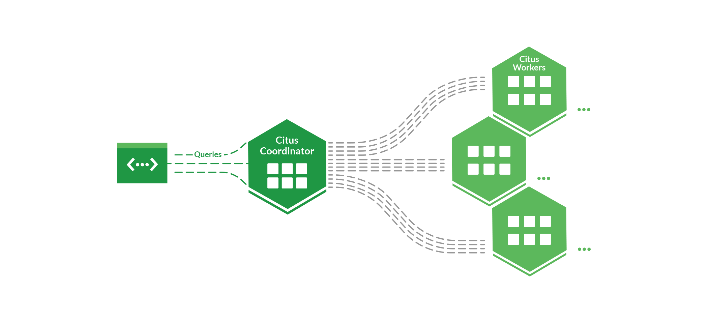
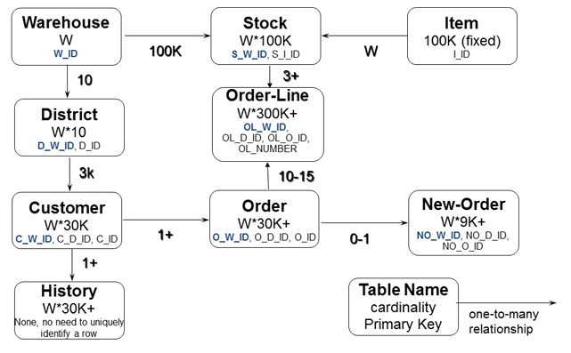

<!-- _class: titlepage -->


<div class="title"> Comparativo entre bases de dados distribuídas SQL e NoSQL </div>
<div class="subtitle"      > Análises e resultados de sistemas e estratégias </div>
<br>
<div class="author"        > Lívia Lelis 12543822 </div>
<div class="author"        > Lourenço de Salles Roselino 11796805 </div>
<div class="author"        > Samuel Figueiredo Veronez 12542626 </div>
<div class="date"          > SCC0243 - Arquitetura de Sistemas Gerenciadores de Base de Dados </div>
<div class="organization"  > São Carlos - SP | 1°Semestre 2025 ICMC-USP </div>

---

# Introdução & Motivação

Tendo em vista a demanda crescente por sistemas eficientes e robustos para dados este trabalho foi desenvolvido para avaliar a performance e <i>overhead</i> entre diferentes sistemas gerenciadores de base de dados, distribuídos e centralizados.

Este trabalho não visa fazer uma comparação direta entre a performance individual de cada SGBD e sim estudar e entender suas técnicas de distribuição, configurações e comparar os beneficios de seus escalonamentos horizontais.

---

# Conceitos para Bases de Dados Distribuídas

- Fragmentação
  - Horizontal
  - Vertical
  - Mista
- Replicação
- Homogenidade e Heterogenidade
- Alocação de dados

---

<!-- _class: transition -->


# Citus

---

# Citus

Citus é uma extensão do PostgreSQL para bancos de dados distribuídos. O Citus apresenta suporte à fragmentação horizontal, fragmentação por esquema e replicação de dados.

---

<center>

# Modelos de fragmentação

</center>

<div class="columns">
<div>

## Fragmentação Horizontal

Um único esquema é utilizado entre todos
os nós, tendo a fragmentação feita por
tuplas que tem seu nó de residência determinado por uma coluna
de distribuição.

</div>

<div>

## Fragmentação por Esquema

Permite diferentes nós usarem diferentes esquemas, não permite junções entre esquemas distribuidos nem paralelização de queries mas ainda permite tabelas de referência em esquemas não fragmentados.

</div>
</div>

---

<div class="columns">
<div>



<figcaption align="center">
<b>Figura</b>: Arquitetura coordinator-worker do Citus. Obtido em: https://github.com/citusdata/citus#Architecture
</figcaption>

</div>
<div>

- Dois tipos de nós: worker e coordinator

- Worker armazenam os dados das tabelas distribuidas e processam as consultas
- Cada coordinator node gerencia um cluster de worker nodes
  - Faz o intermédio das consultas da aplicação entre um ou múltiplos nós, acumulando e retornando os resultados para a aplicação
  - Também também mantém a alocação, o controle da consistência dos dados e da integridade dos nós trabalhadores.

</div>
<div>

---

<center>

# Tipos de Tabelas

</center>

<div class="columns3">
<div>

### Tabelas distribuídas

Tabelas com os dados particionados e distribuídos entre vários nós trabalhadores, permitindo consultas e operações paralelas.

</div>

<div>

### Tabelas de referência

São tabelas replicadas em todos os nós trabalhadores, utilizadas para armazenar dados pequenos e frequentemente acessados.

</div>

<div>

### Tabelas locais

São tabelas que existem apenas no nó coordenador e não são distribuídas nem replicadas.

</div>

</div>

---

<div class="columns">
<div>

<center>



<figcaption align="center">
<b>Figura</b>: Esquema relacionado do TPC-C. Obtido em: https://www.hammerdb.com/docs3.3/ch03s05.html
</figcaption>

</center>

</div>
<div>
<center>

### TCP-C

</center>

- Benchmark padronizado pela Transaction Processing Performance Council.
- Simula um sistema de empresa de vendas por atacado e transações típicas.
  - Novos Pedidos
  - Pagamentos
  - Processamento de Entregas
  - Consulta de Status de Pedidos
  - Consulta de Níveis de Estoque

</div>
<div>

---

# Estratégia de Distribuição do Citus

```sql
-- Distribution Configuration
SELECT create_distributed_table('customer', 'c_w_id')
SELECT create_distributed_table('district', 'd_w_id')
SELECT create_distributed_table('history', 'h_w_id')
SELECT create_distributed_table('warehouse', 'w_id')
SELECT create_distributed_table('stock', 's_w_id')
SELECT create_distributed_table('new_order', 'no_w_id')
SELECT create_distributed_table('orders', 'o_w_id')
SELECT create_distributed_table('order_line', 'ol_w_id')

SELECT create_reference_table('item')
```

---

# Ambiente

- PostgreSQL 17 & Citus 13
- Single Node x Multi Node ( 1 coord. ; 3 workers )
- Inicial: 4 CPUs e 8GB de RAM, restringidos via Docker no mesmo host
- Cloud: 4 vCPUs e 8GB de RAM, droplets de recurso compartilhado na DO

---

<!-- _class: transition -->

# Resultados do Benchmark (Local)

---

- **Single-Node**: 31.405 operações novas e 62.424 transações por minuto
- **Multi-Node**: 15.304 operações novas e 35.762 transações por minuto

---

# Ganho de performance e eficiência

| Métrica              | Single-Node | Multi-Node | Speedup | Eficiência (3 nós) | Eficiência (4 nós) |
|----------------------|-------------|------------|---------|--------------------|--------------------|
| Operações novas/min  | 31.405      | 15.304     | 0.49×   | 16.4%              | 12.3%              |
| Transações/min       | 62.424      | 35.762     | 0.57×   | 18.9%              | 14.3%              |

---

| PROC     | Replicas | MIN (ms) | AVG (ms) | MAX (ms)  | P99 (ms) | P95 (ms) | P50 (ms) |
| -------- | -------- | -------- | -------- | --------- | -------- | -------- | -------- |
| PAYMENT  | Single   | 0.833    | 52.601   | 1257.365  | 413.035  | 167.278  | 27.633   |
|          | Multi    | 0.990    | 101.086  | 1767.711  | 611.674  | 352.694  | 72.123   |
| NEWORD   | Single   | 1.640    | 48.569   | 1255.893  | 413.374  | 160.868  | 23.915   |
|          | Multi    | 1.774    | 107.871  | 1737.546  | 607.420  | 362.191  | 83.081   |
| SLEV     | Single   | 0.440    | 153.889  | 21302.445 | 4235.829 | 73.669   | 6.215    |
|          | Multi    | 0.612    | 63.438   | 5600.833  | 730.162  | 224.685  | 8.710    |
| DELIVERY | Single   | 1.278    | 54.623   | 1417.772  | 441.496  | 191.119  | 25.470   |
|          | Multi    | 2.286    | 115.989  | 1505.085  | 596.206  | 375.478  | 90.453   |
| OSTAT    | Single   | 0.104    | 2.725    | 455.587   | 47.199   | 3.844    | 1.292    |
|          | Multi    | 0.269    | 7.474    | 609.841   | 80.547   | 60.180   | 2.439    |

---

<!-- _class: transition -->

# Resultados do Benchmark (Cloud)

---

- **Single-Node**: 51.498 operações novas e 118.229 transações por minuto  
- **Multi-Node**: 67.108 operações novas e 154.437 transações por minuto

---

# Ganho de performance e eficiência

| Métrica              | Single-Node | Multi-Node | Speedup | Eficiência (3 nós) | Eficiência (4 nós) |
|----------------------|-------------|------------|---------|--------------------|--------------------|
| Operações novas/min  | 51.498      | 67.108     | 1.30×   | 43.3%              | 32.6%              |
| Transações/min       | 118.229     | 154.437    | 1.31×   | 43.7%              | 32.7%              |

---

| PROC     | Replicas | MIN (ms) | AVG (ms) | MAX (ms)   | P99 (ms) | P95 (ms) | P50 (ms) |
| -------- | -------- | -------- | -------- | ---------- | -------- | -------- | -------- |
| NEWORD   | Single   | 0.857    | 47.773   | 497.174    | 191.415  | 127.932  | 38.338   |
|          | Multi    | 2.333    | 26.435   | 582.658    | 211.060  | 113.347  | 9.682    |
| PAYMENT  | Single   | 0.400    | 15.545   | 422.251    | 112.142  | 50.166   | 9.886    |
|          | Multi    | 1.028    | 22.988   | 767.196    | 238.873  | 138.448  | 4.133    |
| DELIVERY | Single   | 0.990    | 74.445   | 667.467    | 268.406  | 184.238  | 62.080   |
|          | Multi    | 2.539    | 26.001   | 388.739    | 144.493  | 89.586   | 13.082   |
| SLEV     | Single   | 0.926    | 22.806   | 14.701.909 | 130.593  | 54.970   | 7.961    |
|          | Multi    | 1.629    | 31.134   | 12.533.507 | 672.486  | 56.177   | 4.754    |
| OSTAT    | Single   | 0.400    | 10.674   | 364.984    | 63.122   | 34.078   | 6.585    |
|          | Multi    | 0.990    | 8.749    | 244.090    | 62.440   | 33.984   | 3.864    |

---
<!-- _class: transition -->


# Cassandra 👁

---

# Cassandra

Apache Cassandra é um banco de dados _open-source_ NoSQL distribuído, sendo classificado como um _Wide-Column Database_.

- Arquitetura _masterless_ com _clusters_ organizados em forma de anel

<center>


</center>

---

# Wide Column

- Organização em linhas e colunas, com formatos que podem variar para uma mesma tabela.
- Chave Primária definida como chave de partição e, opcionalmente, chave de clustering.

---

# Estrutura de Dados e Particionamento

- Organização em _keyspaces_, distribuição por intervalod do espaço de tonkens

- Cada linha é identificada por uma chave primária composta por um partition key e, opcionalmente, colunas de ordenação

---

# Replicação, Tolerância a Falhas e Consistência

- Configurável por _keyspace_, permitindo definir o fator e a estratégia de replicação.

- _Tunable consistency_, permitindo o usuário definir por operação quantos nós precisam confirmar uma leitura ou escrita para que ela seja bem-sucedida.

- Por padrão opera como sistema _AP_ (alta disponibilidade e tolerância a partições), mas pode ser configurado como _CP_(consistência e tolerância a partições)

---

# Yahoo! Cloud Serving Benchmarking (YCSB)

- Benchmark amplamente utilizado para sistemas de banco de dados NoSQL.

- O YCSB utiliza um modelo de dados simples baseado em chave-valor. O formato
padrão do banco de dados possui 1 chave primária _YCSB_KEY_ e um conjunto de dados _FIELD0_, _FIELD1_, ..., _FIELD9_ que por padrão são tipo String.

---

# Ambiente

- Cassandra 4.1
- Single Node x Multi Node ( 3 instâncias )
- Cloud: 4 vCPUs e 8GB de RAM, droplets de recurso compartilhado na DO

<!-- _class: transition2 -->

# Resultados do Cassandra

---

# Tempos de benchmark no YCSB

| Configuração         | Tempo de Carregamento (ms) | Tempo de Execução (ms) |
| :------------------- | -------------------------: | ---------------------: |
| Nó único             |                    386 275 |                625 923 |
| 3 nós sem replicação |                    224 126 |                225 164 |
| 3 nós com replicação |                    477 892 |                552 229 |

---

# Ganho de performance e eficiência

| Configuração         | Tempo de Carregamento (ms) | Speedup Carga | Eficiência Carga | Tempo de Execução (ms) | Speedup Execução | Eficiência Execução |
|----------------------|-----------------------------|---------------|------------------|--------------------------|-------------------|----------------------|
| Nó único             | 386 275                     | 1.00×         | -                | 625 923                  | 1.00×             | -                    |
| 3 nós sem replicação | 224 126                     | 1.72×         | 57.3%            | 225 164                  | 2.78×             | 92.7%                |
| 3 nós com replicação | 477 892                     | 0.81×         | 27.0%            | 552 229                  | 1.13×             | 37.7%                |

---

# Resultados do benchmark YCSB - Único nó

| Operação |  Operações | Latência Média (μs) | Latência Mín (μs) | Latência Máx (μs) | 95\% (μs) | 99\% (μs) |
| :------- | ---------: | ------------------: | ----------------: | ----------------: | --------: | --------: |
| INSERT   | 10 000 000 |            1 222,82 |               197 |           148 607 |     1 961 |     5 299 |
| READ     |  5 000 753 |            2 296,55 |               220 |           135 295 |     4 583 |    11 775 |
| UPDATE   |  4 999 247 |            1 681,11 |               159 |           149 759 |     2 923 |     7 011 |

---

# Resultados agregados do benchmark YCSB - 3 nós sem replicação

| Operação |  Operações | Latência Média (μs) | Latência Mín (μs) | Latência Máx (μs) | 95\% (μs) | 99\% (μs) |
| :------- | ---------: | ------------------: | ----------------: | ----------------: | --------: | --------: |
| INSERT   | 10 000 000 |              703,01 |               159 |           139 135 |     1 084 |     2 669 |
| READ     |  4 998 961 |              759,82 |               210 |            97 151 |     1 205 |     2 307 |
| UPDATE   |  5 001 039 |              656,09 |               160 |            95 935 |     1 087 |     2 964 |

---

# Resultados agregados do benchmark YCSB - 3 nós com replicação

| Operação |  Operações | Latência Média (μs) | Latência Mín (μs) | Latência Máx (μs) | 95\% (μs) | 99\% (μs) |
| :------- | ---------: | ------------------: | ----------------: | ----------------: | --------: | --------: |
| INSERT   | 10 000 000 |            1 514,36 |               186 |           149 119 |     3 843 |     9 103 |
| READ     |  5 000 119 |            2 334,83 |               268 |           125 119 |     5 563 |    11 191 |
| UPDATE   |  4 999 881 |            1 170,27 |               182 |           114 431 |     3 099 |     5 983 |

---

# Conclusão

| Métrica / Configuração              | Speedup | Eficiência (3 nós) | Eficiência (4 nós) |
| ----------------------------------- | ------- | ------------------ | ------------------ |
| **PostgreSQL - Operações/min**      | 1.30×   | 43.3%              | 32.6%              |
| **PostgreSQL - Transações/min**     | 1.31×   | 43.7%              | 32.7%              |
| **Cassandra - Carga (sem rép.)**    | 1.72×   | 57.3%              | —                  |
| **Cassandra - Carga (com rép.)**    | 0.81×   | 27.0%              | —                  |
| **Cassandra - Execução (sem rép.)** | 2.78×   | 92.7%              | —                  |
| **Cassandra - Execução (com rép.)** | 1.13×   | 37.7%              | —                  |

---

# Perguntas
